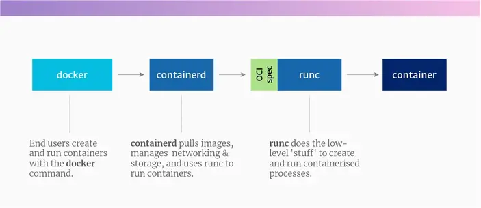
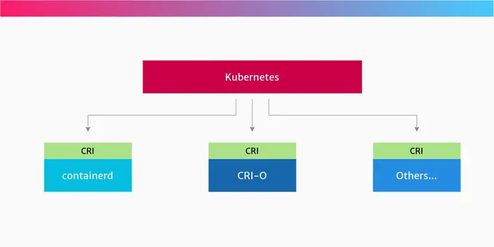
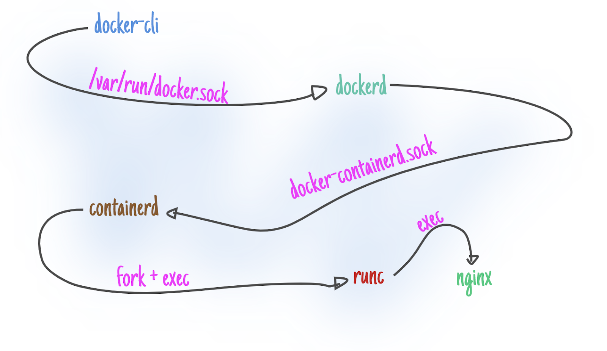

#   High Level docker view and componenets
##  Componenets


##  How the Docker stack works




```
But, over time, Kubernetes evolved into a container-agnostic platform. The Container Runtime Interface (CRI) API was created in Kubernetes, which allows different container runtimes to be plugged into it.
Docker Engine, being a project older than Kubernetes, doesn’t implement CRI. So to help with the transition, the Kubernetes project included a component called dockershim, which allowed Kubernetes to run containers with the Docker runtime.

But, as of Kubernetes 1.24, the dockershim component was removed completely, and Kubernetes no longer supports Docker as a container runtime. Instead, you need to choose a container runtime that implements CRI.

The logical successor to Docker Engine in Kubernetes clusters is… containerd. (10 points if you got that correct!) Or you can use an alternative runtime, like CRI-O.
```

##  Open Container Initiative (OCI) specifications
```
The OCI was one of the first efforts at creating some standards for the container world. It was established in 2015 by Docker and others.

The idea behind the OCI specifications, is to standardise what a container is, and what it should be able to do. That means you’re free to choose between different runtimes which conform to the specification. And each of these runtimes might have a different lower-level implementation.

For example: you might use one OCI-compliant runtime for your Linux hosts, but a different runtime for your Windows hosts.
```

## Kubernetes Container Runtime Interface
```
The other standard we need to talk about is the Container Runtime Interface (CRI). This is an API that was created by the Kubernetes project.

CRI is an interface used by Kubernetes to control the different runtimes that create and manage containers.

Kubernetes tries not to care which container runtime you use. It just needs to be able to send instructions to it – to create containers for Pods, terminate them, and so on. And that’s where CRI comes in. CRI is an abstraction for any kind of container runtime that might exist now, or in the future. So CRI makes it easier for Kubernetes to use different container runtimes.

Instead of the Kubernetes project needing to add support for each runtime individually, the CRI API describes how Kubernetes will interact with any runtime. As long as a given container runtime implements the CRI API, the runtime can create and start containers however it like
```




## containerd
```
containerd is a high-level container runtime that came from Docker. It implements the CRI spec. It pulls images from registries, manages them and then hands over to a lower-level runtime, which uses the features of the Linux kernel to create processes we call ‘containers’.

So internally, Docker Engine uses containerd. When you install Docker, it will also install containerd.

containerd can be used as the container runtime for Kubernetes, because it implements the Kubernetes Container Runtime Interface (CRI), via its cri plugin.
```

##  CRI-O
```
CRI-O is another high-level container runtime which implements the Kubernetes Container Runtime Interface (CRI). It’s an alternative to containerd. It pulls container images from registries, manages them on disk, and launches a lower-level runtime to run container processes.

Yes, CRI-O is another container runtime. It was born out of Red Hat, IBM, Intel, SUSE and others. See here for the backstory on why CRI-O was created.

CRI-O was created to be a container runtime for Kubernetes. It provides the ability to start, stop and restart containers, just like containerd.

Just like containerd, CRI-O implements the CRI API, so it can be used as a container runtime on Kubernetes.
```

##  runc
```
runc and other low-level runtimes
runc is an OCI-compatible container runtime. It implements the OCI specification and runs the container processes.
runc is sometimes called the “reference implementation” of OCI.

runc provides all of the low-level functionality for containers, interacting with existing low-level Linux features, like namespaces and control groups. It uses these features to create and run container processes.

Other low-level runtimes
But, runc isn’t the only low-level runtime. The OCI specification is allowing other tools to implement the same functionality in a different way:

crun a container runtime written in C (by contrast, runc is written in Go.)
firecracker-containerd from AWS, which implements the OCI specification as individual lightweight VMs (and it is also the same technology which powers AWS Lambda)

gVisor from Google, which creates containers that have their own kernel. It implements OCI in its runtime called runsc.

```

### reference 
https://www.tutorialworks.com/difference-docker-containerd-runc-crio-oci/


##  Docker  Architecture 

Docker Engine is a client-server technology that facilitates the activities and workflows associated with developing, shipping, and running container-based applications. The engine launches a server-side daemon mechanism that serves as a host for images, containers, networks, and storage volumes



